# Advanced Lane Lines Detection

Final Project Video can be found on [GoogleDrive](https://drive.google.com/drive/folders/1FtSDQqfM-zir0bwEGAteVRfMtiHTx1fT?usp=sharing)

## Project Overview

### 1.1 Goal
The goal of this project is to use traditional Computer Vision (i.e. non-machine learning) techniques to develop an advanced and robust algorithm that can detect and track lane boundaries in a video. This project is operated under the following scenarios:

* It can detect *exactly* two lane lines, i.e. the left and right lane boundaries of the lane the vehicle is currently driving in.
* It cannot detect adjacent lane lines
* The vehicle must be within a lane and must be aligned along the direction of the lane

### 1.2 Project structure

* **lane_tracker.ipynb**: Jupyter notebook with a step-by-step walkthrough of the different components of the pipeline 
* **camera_cal/**: Folder containing a collection of chessboard images used for camera calibration and distortion correction
* **camera_calib.p**: Pickle file containing the saved camera calibration matrix and distortion coefficients
* **test_images/**: Folder containing a set of images for test purposes
* **gif_images/**:
* **readme_images**: Directory to store images used within this README.md
* **project_video.mp4**: Video with dark road surfaces and non-uniform lighting conditions
* **project_video_output.mp4**: Resulting output on passing the project_video through the pipeline

## 2. Project Model

The various steps invovled in the pipeline are as follows, each of these has also been discussed in more detail in the sub sections below:

* Compute the camera calibration matrix and distortion coefficients given a set of chessboard images.
* Apply a distortion correction to raw images.
* Apply a perspective transform to rectify image ("birds-eye view").
* Use color transforms, gradients, etc., to create a thresholded binary image.
* Detect lane pixels and fit to find the lane boundary.
* Determine the curvature of the lane and vehicle position with respect to center.
* Warp the detected lane boundaries back onto the original image.
* Output visual display of the lane boundaries and numerical estimation of lane curvature and vehicle position.

### 2.1 Camera calibration and distortion correction

This process has been visualised below for.

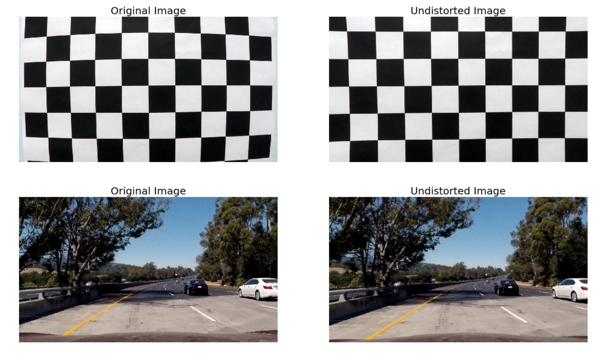

### 2.2 Perspective Transformation & ROI selection

Following the distortion correction, an undistorted image undergoes Perspective Transformation which warpes the image
into a *bird's eye view* scene. This makes it easier to detect the lane lines (since they are relatively parallel) and measure their curvature.

An example of this has been showcased below for convenience.

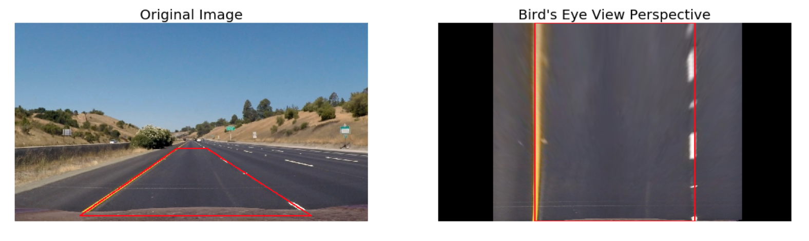
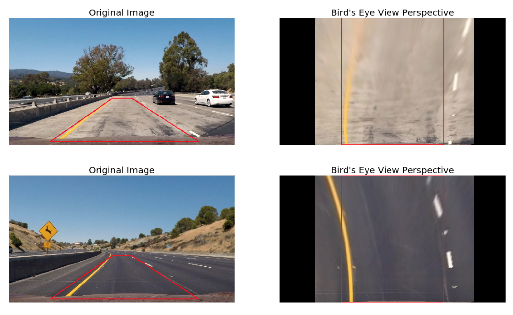

### 2.3 Generation of thresholded binary image

    
The image below showcases the masking operation and the resulting thresholded binary image from the ensemble for two test images.

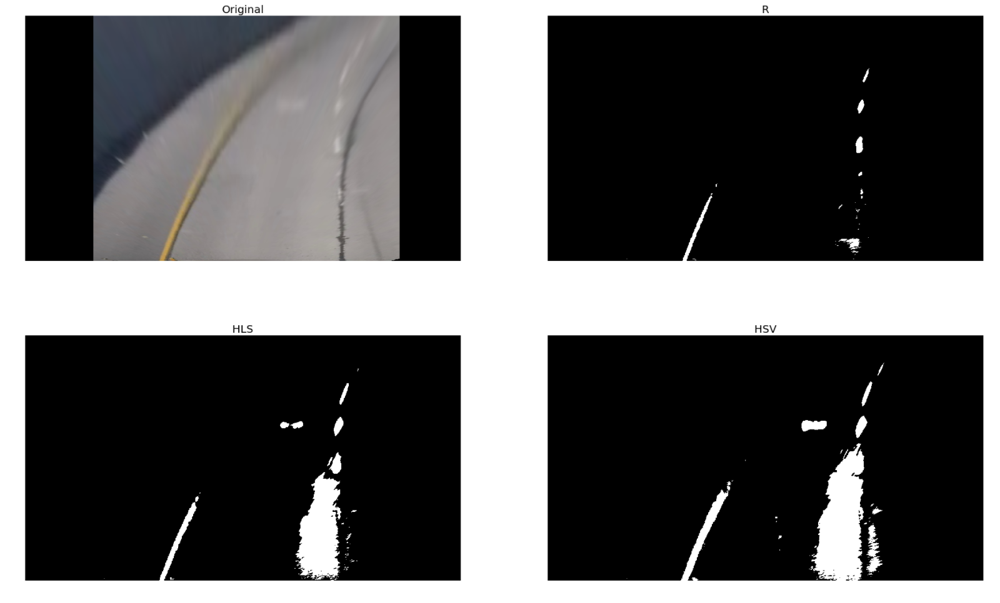
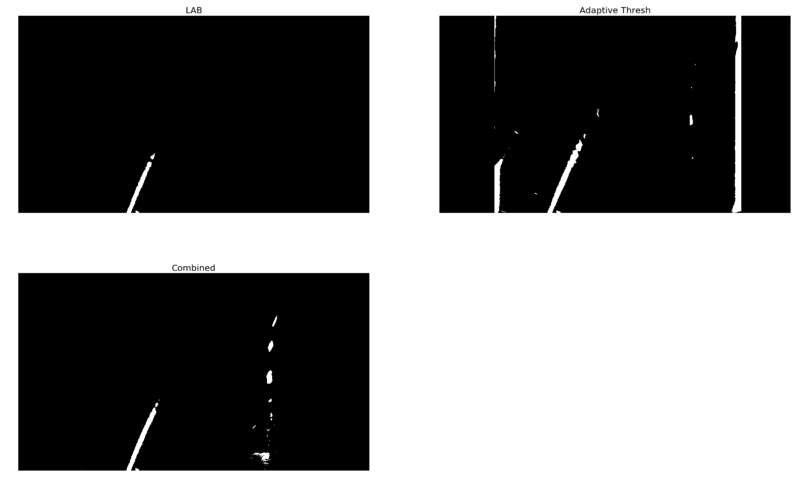
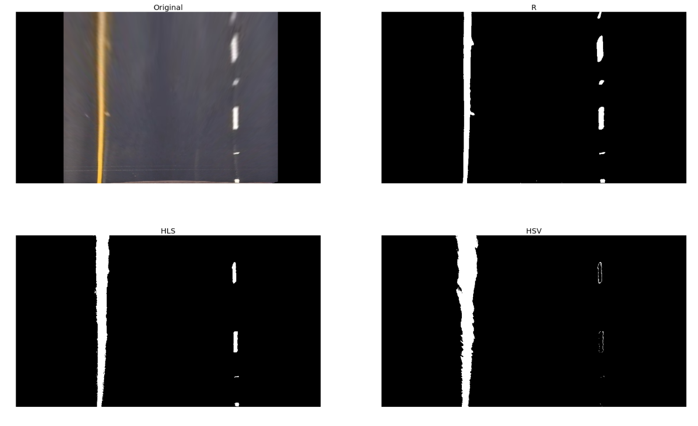
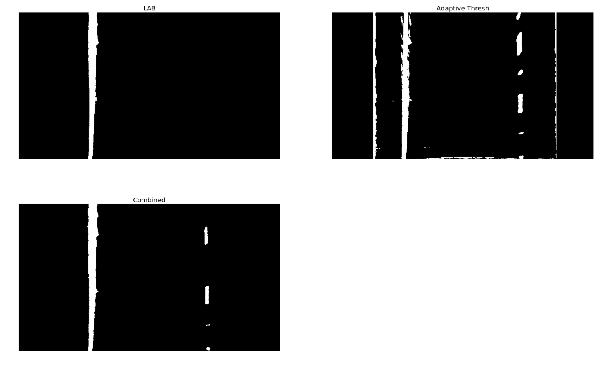

### 2.4 Lane Line detection: Sliding Window technique

We now have a *warped, thresholded binary image* where the pixels are either 0 or 1; 0 (black color) constitutes the unfiltered pixels and 1 (white color) represents the filtered pixels. The next step involves mapping out the lane lines and  determining explicitly which pixels are part of the lines and which belong to the left line and which belong to the right line.

The technique employed here is: **Peaks in Histogram & Sliding Windows**

The *'hot' pixels* that we have found are then fit to a second order polynomial. The reader should note that we are fitting for ```y``` as opposed to ```x``` since the lines in the warped image are near vertical and may have the same x value for more than one y value. Once we have computed the 2nd order polynomial coefficients, the line data is obtained for y ranging from (0, 720 i.e. image height) by using the mathematical formula: 

```x = f(y) = Ay^2 + By + C```

A visualisation of this process can be seen below.

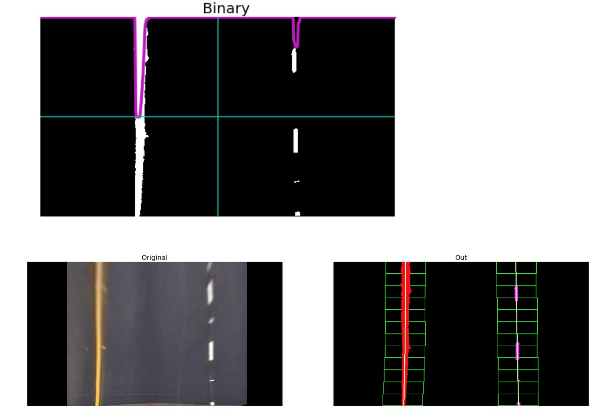
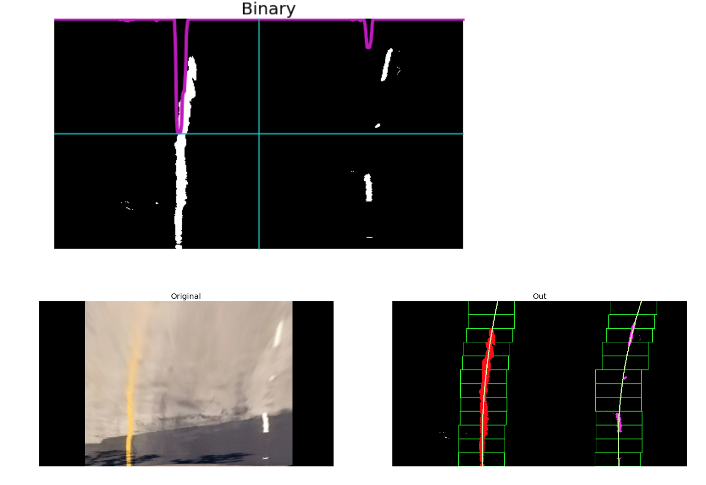

Here, the red and pink color represents the 'hot' pixels for the left and right lane lines respectively. Furthermore, the line in green is the polyfit for the corresponding 'hot' pixels.

### 2.5 Lane Line detection: Adaptive Search

Once we have successfully detected the two lane lines, for subsequent frames in a video, we search in a margin around the previous line position instead of performing a blind search.

Hence, a custom *Adaptive Search technique* was implemented to operate once a frame was successfully analysed and a pair of lane lines were polyfit through the Sliding Windows technique. This method:

1. Follows along the trajectory of the previous polyfit lines and splits the image into a number of smaller windows.
2. These windows are then iteratively passed into the ```get_binary_image``` function (defined in Step 4 of the pipeline) and their threshold values are computed as the mean of the pixel intensity values across the window
3. Following this iterative thresholding process, the returned binary windows are stacked together to get a single large binary image with dimensions same as that of the input image


A visualisation of this process has been showcased below.

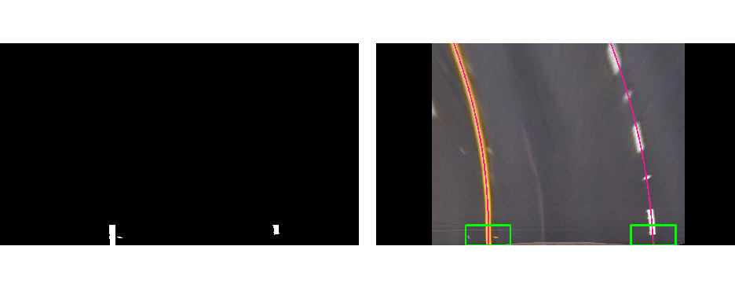

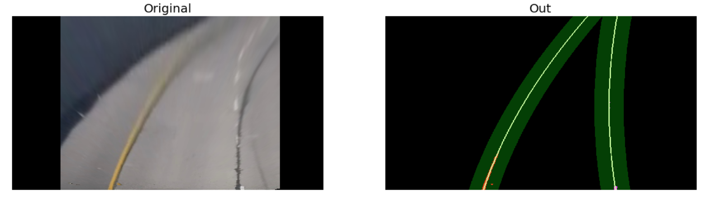
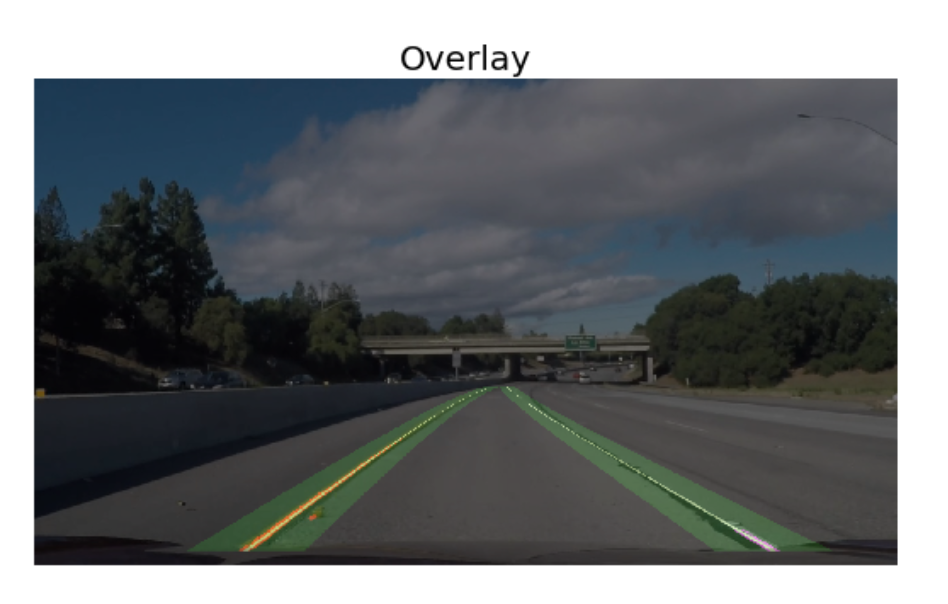

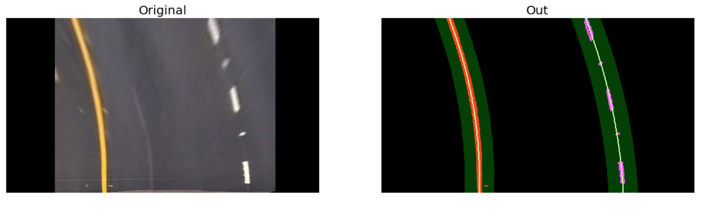


### 2.6 Conversion from pixel space to real world space

To report the lane line curvature in metres we first need to convert from pixel space to real world space. For this, we measure the width of a section of lane that we're projecting in our warped image and the length of a dashed line. Once measured, we compare our results with the U.S. regulations (as highlighted [here](http://onlinemanuals.txdot.gov/txdotmanuals/rdw/horizontal_alignment.htm#BGBHGEGC)) that require a minimum lane width of 12 feet or 3.7 meters, and the dashed lane lines length of 3.048 meters.

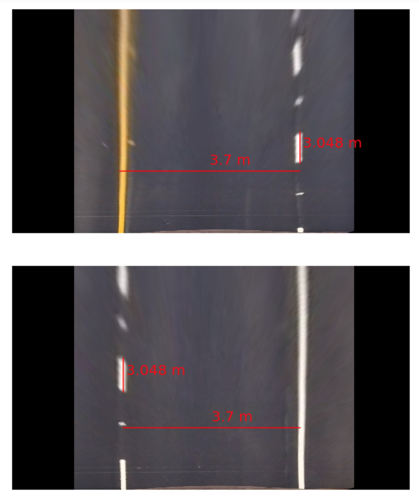


### 2.7 Curvature and Offset

A visualisation for this step can be seen below.

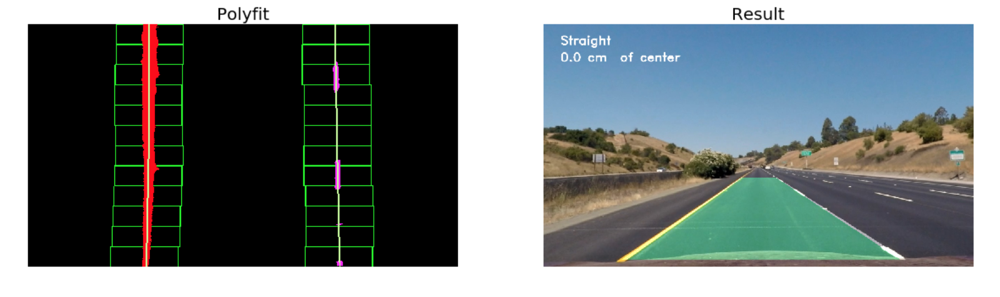
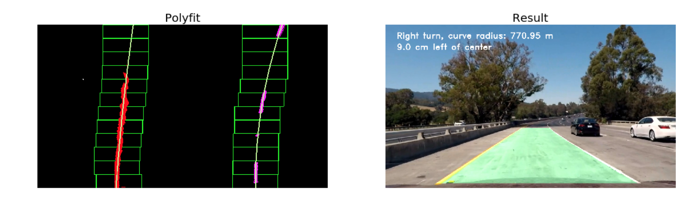


### 2.8 Final Project

An image processing pipeline is therefore setup that runs the steps detailed above in sequence to process a video frame by frame. The results of the pipeline on two test videos can be visualised in the ```project_video_output.mp4```.

An example of a processed frame has been presented to the reader below.

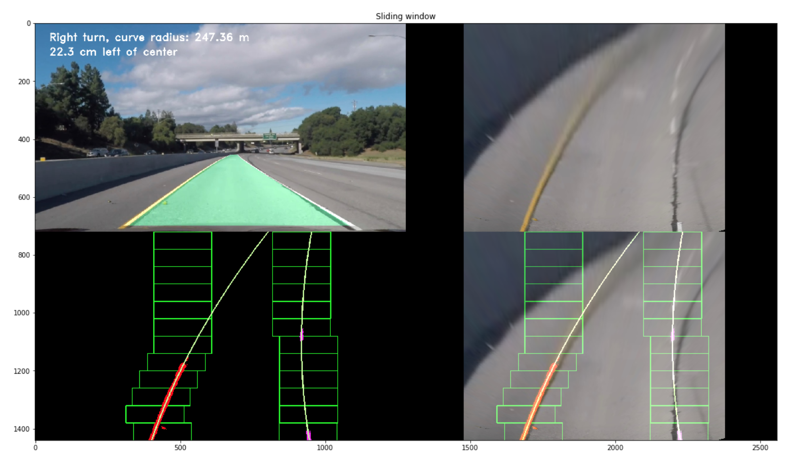

## 3. Future Work Idea

This was a very tedious project which involved the tuning of several parameters by hand. With the traditional Computer Vision approach I was able to develop a strong intuition for what worked and why. I also learnt that the solutions developed through such approaches aren't very optimised and can be sensistive to the chosen parameters. As a result, I developed a strong appreciation for Deep Learning based approaches to Computer Vision. Although, they can appear as a black box at times Deep learning approaches avoid the need for fine-tuning these parameters, and are inherently more robust. 

In coming weaks i will try to implement a Deeplearning Computer Vision method to implement Lane Detection and image segmentation using Mask-CNN and im also currently working in a SelfDriving Car Research project.

## Made by- Aryan Karn 
            
